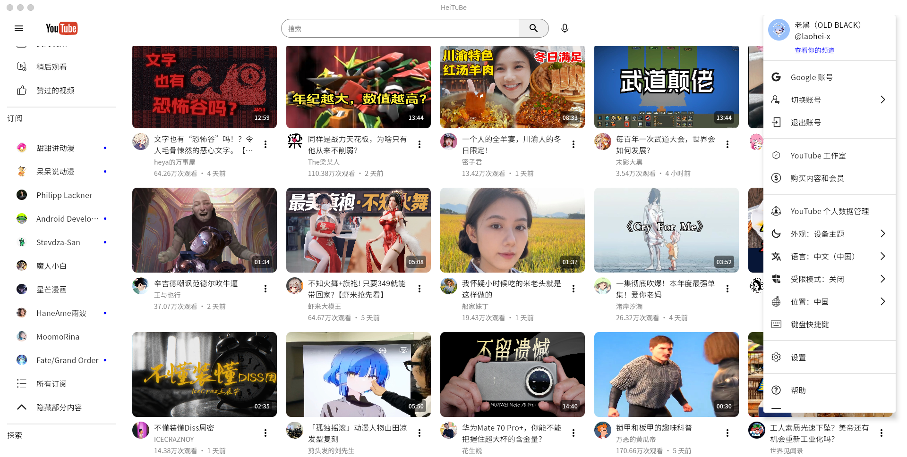

这是一个 Kotlin Multiplatform 项目：Android, iOS（暂无设备适配，不清楚具体运行情况）, Web, Desktop, Server。

## 运行项目

在运行项目前，注意项目环境的配置（Desktop 使用 openjdk 17）

1. 克隆项目到本地，使用 Android Studio 或者 Fleet 打开项目，等待所需依赖加载。

```
https://github.com/laohei7/HeiTuBe.git
```

2. 先启动 Server 模块，确保代理服务正常运行。

```
./gradlew :server:run
```

3. 启动 UI 各模块。

```
# Desktop
./gradlew :composeApp:run

# Web
./gradlew :composeApp:wasmJsBrowserRun
```

运行 Android 模块， 在 Android Studio 或 Fleet 中，按正常 Android 项目运行即可。

## 注意事项

1. 运行 `Android` 模块时，注意将 `HomeViewmodel` 中的 `host` 改为你本机的 ip。
2. 网络图片加载统一使用 `Server` 模块代理，解决 Web 跨域问题
3. 运行时，如果未显示数据，检查 Server 模块日志，是否是 Json 映射异常，如果是，在 `shared` 模块的 `BiliHots`
   找到对应字段进行修改，一般添加个默认值即可。

## 运行效果

### Android

<p align="center">
    
    
</p>

### Desktop（Ubuntu）



<p align="center">
    
    
</p>

### Web


## LICENSE

   Copyright 2024 laohei7

   Licensed under the Apache License, Version 2.0 (the "License");
   you may not use this file except in compliance with the License.
   You may obtain a copy of the License at

       http://www.apache.org/licenses/LICENSE-2.0

   Unless required by applicable law or agreed to in writing, software
   distributed under the License is distributed on an "AS IS" BASIS,
   WITHOUT WARRANTIES OR CONDITIONS OF ANY KIND, either express or implied.
   See the License for the specific language governing permissions and
   limitations under the License.

